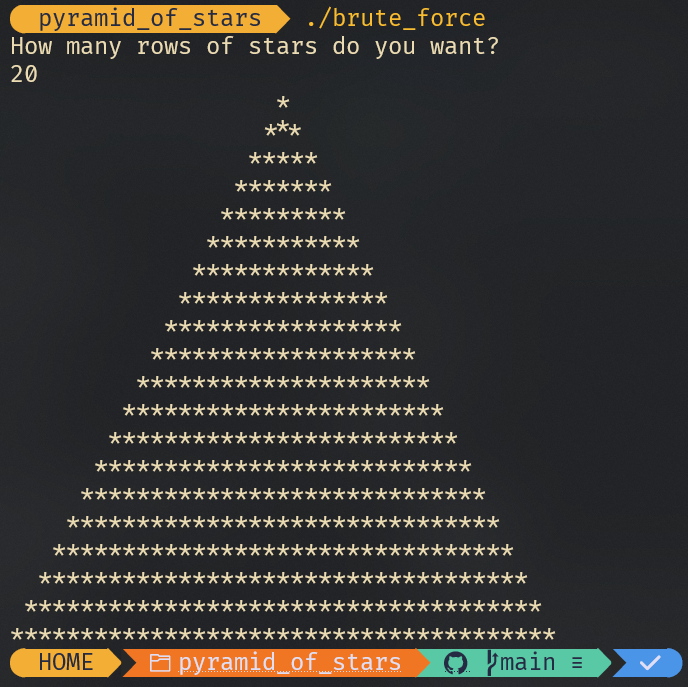

# Note
This directory contains code to print out a pyramid of stars with a number of rows as given by the use.

The implementation is done in various ways and methods.

## 1. Brute Force Method
Trial and error until the solutions works.

## 2. Using a matrix
Here we start by determining how many columns we will need given rows. Can be given by:

`columns = rows * 2 - 1`

We print stars from column `n - (i - 1)` to `n + (i - 1)`, where n is the number of rows we want to print.